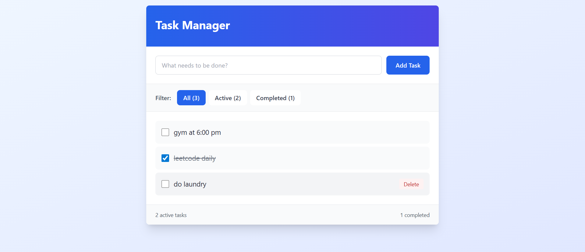

# Basic Task Manager (Assignment 1)

This project is a simple full-stack application for "Home Assignment 1 - Basic Task Manager". It consists of a .NET 8 backend API and a React frontend, allowing users to manage a simple to-do list. The backend uses in-memory data storage.

## Screenshot



## Technologies Used

* **Backend:** C# .NET 8 Web API
* **Frontend:** React with TypeScript
* **Build Tool:** Vite
* **API Client:** Axios

## Features

Based on the assignment requirements, the application supports the following features:
* Display a list of tasks
* Add a new task with a description
* Mark a task as completed or uncompleted
* Delete a task

## API Endpoints

The backend provides the following RESTful API endpoints, as defined in `TasksController.cs`:

| Method | Endpoint          | Description                                               |
| :----- | :---------------- | :-------------------------------------------------------- |
| `GET`    | `/api/tasks`      | Retrieves all tasks.                                      |
| `GET`    | `/api/tasks/{id}` | Retrieves a single task by its ID.                        |
| `POST`   | `/api/tasks`      | Creates a new task.                                       |
| `PUT`    | `/api/tasks/{id}` | Updates an existing task (description or completion status). |
| `DELETE` | `/api/tasks/{id}` | Deletes a task by its ID.                                 |

## How to Run

### Backend (`/backend/TaskManager.Api`)

1.  Navigate to the backend directory:
    ```sh
    cd backend/TaskManager.Api
    ```
2.  Run the application:
    ```sh
    dotnet run
    ```

### Frontend (`/frontend`)

1.  Navigate to the frontend directory:
    ```sh
    cd frontend
    ```
2.  Install dependencies:
    ```sh
    npm install
    ```
3.  Start the development server:
    ```sh
    npm run dev
    ```
    The application will be available at `http://localhost:5161` (or a similar port specified by Vite).